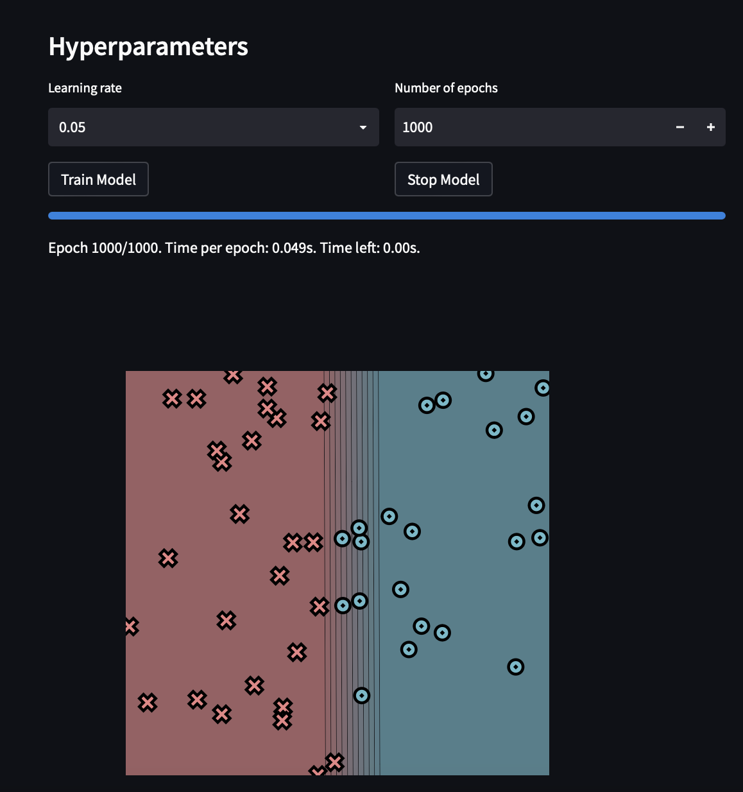
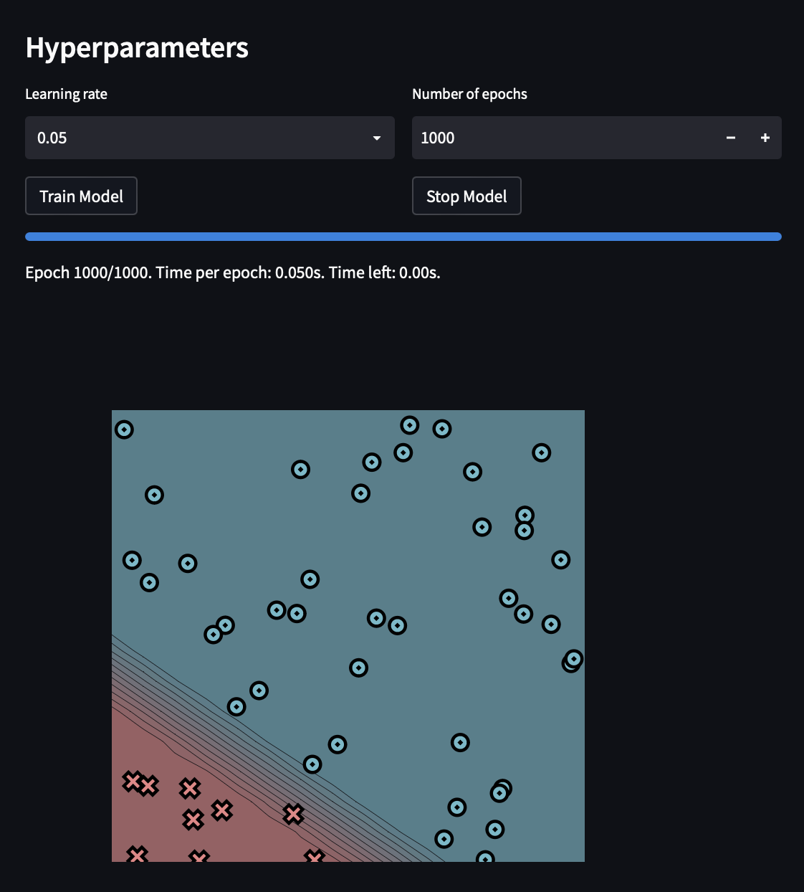
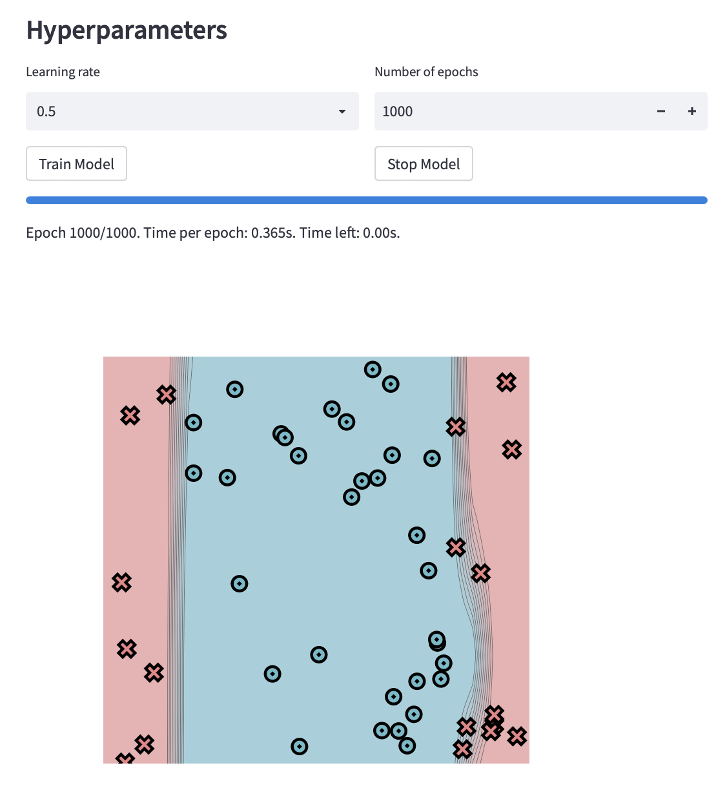
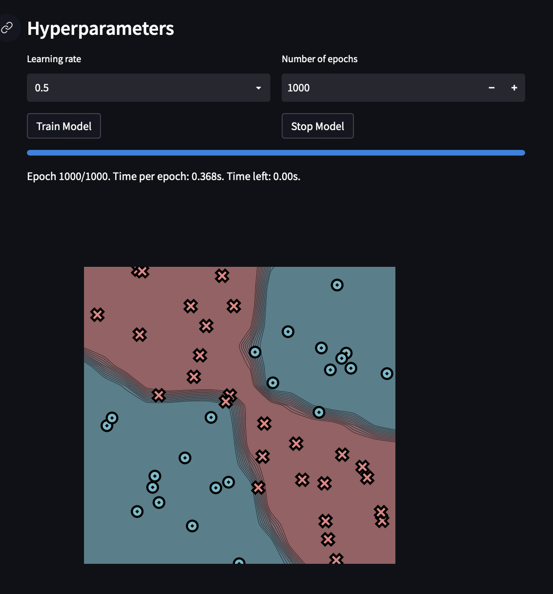

[](https://classroom.github.com/a/YFgwt0yY)
# MiniTorch Module 2


* Docs: https://minitorch.github.io/

* Overview: https://minitorch.github.io/module2/module2/

This assignment requires the following files from the previous assignments. You can get these by running

```bash
python sync_previous_module.py previous-module-dir current-module-dir
```

The files that will be synced are:

        minitorch/operators.py minitorch/module.py minitorch/autodiff.py minitorch/scalar.py minitorch/scalar_functions.py minitorch/module.py project/run_manual.py project/run_scalar.py project/datasets.py


# Simple Dataset (50 Points, 2 Hidden Units)

- Learning Rate: 0.05
- Epochs: 1000
- Final Loss: 8.2188
- Final Accuracy: 100.00%
- Correct Predictions: 50 out of 50
- Time per epoch: 0.049s
<!--  -->



<details>
  <summary>Click for Training Logs</summary>


        Epoch: 0/1000, loss: 0, correct: 0
        Epoch: 10/1000, loss: 36.13363920785243, correct: 22
        Epoch: 20/1000, loss: 35.38999095231236, correct: 22
        Epoch: 30/1000, loss: 34.96903001460037, correct: 27
        Epoch: 40/1000, loss: 34.7071314316779, correct: 24
        Epoch: 50/1000, loss: 34.527585319684235, correct: 23
        Epoch: 60/1000, loss: 34.39211967960916, correct: 25
        Epoch: 70/1000, loss: 34.280626690481036, correct: 26
        Epoch: 80/1000, loss: 34.182016087539395, correct: 26
        Epoch: 90/1000, loss: 34.08984069408258, correct: 27
        Epoch: 100/1000, loss: 34.00010579323866, correct: 28
        Epoch: 110/1000, loss: 33.910129299719834, correct: 28
        Epoch: 120/1000, loss: 33.817927651154754, correct: 28
        Epoch: 130/1000, loss: 33.72187279272618, correct: 28
        Epoch: 140/1000, loss: 33.62049214438685, correct: 28
        Epoch: 150/1000, loss: 33.51234507171138, correct: 28
        Epoch: 160/1000, loss: 33.40843344735302, correct: 28
        Epoch: 170/1000, loss: 33.297345838933225, correct: 28
        Epoch: 180/1000, loss: 33.17478075870728, correct: 28
        Epoch: 190/1000, loss: 33.027445476560686, correct: 28
        Epoch: 200/1000, loss: 32.86514252735715, correct: 28
        Epoch: 210/1000, loss: 32.707342387238285, correct: 28
        Epoch: 220/1000, loss: 32.55102173441571, correct: 28
        Epoch: 230/1000, loss: 32.39781847509581, correct: 28
        Epoch: 240/1000, loss: 32.242034759197814, correct: 28
        Epoch: 250/1000, loss: 32.0878146046844, correct: 28
        Epoch: 260/1000, loss: 31.926527939919072, correct: 34
        Epoch: 270/1000, loss: 31.754054539014287, correct: 34
        Epoch: 280/1000, loss: 31.565757971704617, correct: 34
        Epoch: 290/1000, loss: 31.359966156832428, correct: 34
        Epoch: 300/1000, loss: 31.134867799555565, correct: 34
        Epoch: 310/1000, loss: 30.89848486318344, correct: 37
        Epoch: 320/1000, loss: 30.63689471706283, correct: 38
        Epoch: 330/1000, loss: 30.35488170014892, correct: 38
        Epoch: 340/1000, loss: 30.057655516260066, correct: 39
        Epoch: 350/1000, loss: 29.75178641536607, correct: 40
        Epoch: 360/1000, loss: 29.43097075533098, correct: 41
        Epoch: 370/1000, loss: 29.100251586640148, correct: 41
        Epoch: 380/1000, loss: 28.758306347016216, correct: 43
        Epoch: 390/1000, loss: 28.394406152093367, correct: 44
        Epoch: 400/1000, loss: 28.00600760441186, correct: 45
        Epoch: 410/1000, loss: 27.592496063904434, correct: 45
        Epoch: 420/1000, loss: 27.177354367796866, correct: 46
        Epoch: 430/1000, loss: 26.7430028412186, correct: 46
        Epoch: 440/1000, loss: 26.295474428949404, correct: 47
        Epoch: 450/1000, loss: 25.830002641506248, correct: 47
        Epoch: 460/1000, loss: 25.347279938033182, correct: 47
        Epoch: 470/1000, loss: 24.84647387982043, correct: 47
        Epoch: 480/1000, loss: 24.332935030601213, correct: 47
        Epoch: 490/1000, loss: 23.816971978071695, correct: 47
        Epoch: 500/1000, loss: 23.305869443573037, correct: 47
        Epoch: 510/1000, loss: 22.784578848329105, correct: 47
        Epoch: 520/1000, loss: 22.268437826619028, correct: 48
        Epoch: 530/1000, loss: 21.763719192501117, correct: 48
        Epoch: 540/1000, loss: 21.258582908703985, correct: 48
        Epoch: 550/1000, loss: 20.761799915113816, correct: 48
        Epoch: 560/1000, loss: 20.282078591662454, correct: 48
        Epoch: 570/1000, loss: 19.805322168954593, correct: 48
        Epoch: 580/1000, loss: 19.331155490107076, correct: 48
        Epoch: 590/1000, loss: 18.861600589758822, correct: 48
        Epoch: 600/1000, loss: 18.396217493150218, correct: 48
        Epoch: 610/1000, loss: 17.93582372107541, correct: 49
        Epoch: 620/1000, loss: 17.481386801712514, correct: 49
        Epoch: 630/1000, loss: 17.034527287822442, correct: 49
        Epoch: 640/1000, loss: 16.613242963208986, correct: 49
        Epoch: 650/1000, loss: 16.20600333951454, correct: 49
        Epoch: 660/1000, loss: 15.808275174537682, correct: 49
        Epoch: 670/1000, loss: 15.42040921051156, correct: 49
        Epoch: 680/1000, loss: 15.04272138945774, correct: 49
        Epoch: 690/1000, loss: 14.675458938152884, correct: 49
        Epoch: 700/1000, loss: 14.318798453027782, correct: 49
        Epoch: 710/1000, loss: 13.975259546786548, correct: 50
        Epoch: 720/1000, loss: 13.649452683219009, correct: 50
        Epoch: 730/1000, loss: 13.335989830350403, correct: 50
        Epoch: 740/1000, loss: 13.033708173319395, correct: 50
        Epoch: 750/1000, loss: 12.741803799700312, correct: 50
        Epoch: 760/1000, loss: 12.45994860130755, correct: 50
        Epoch: 770/1000, loss: 12.188131178766692, correct: 50
        Epoch: 780/1000, loss: 11.92955784600079, correct: 50
        Epoch: 790/1000, loss: 11.683368007786187, correct: 50
        Epoch: 800/1000, loss: 11.450500794747668, correct: 50
        Epoch: 810/1000, loss: 11.230417494898923, correct: 50
        Epoch: 820/1000, loss: 11.020452540470457, correct: 50
        Epoch: 830/1000, loss: 10.819256983286115, correct: 50
        Epoch: 840/1000, loss: 10.625680412078832, correct: 50
        Epoch: 850/1000, loss: 10.438581918173119, correct: 50
        Epoch: 860/1000, loss: 10.257425747901598, correct: 50
        Epoch: 870/1000, loss: 10.081920748965159, correct: 50
        Epoch: 880/1000, loss: 9.911797233011386, correct: 50
        Epoch: 890/1000, loss: 9.746804853375641, correct: 50
        Epoch: 900/1000, loss: 9.586710845602536, correct: 50
        Epoch: 910/1000, loss: 9.431298414901402, correct: 50
        Epoch: 920/1000, loss: 9.280365263297124, correct: 50
        Epoch: 930/1000, loss: 9.133722249337538, correct: 50
        Epoch: 940/1000, loss: 8.991192173284492, correct: 50
        Epoch: 950/1000, loss: 8.852608680555448, correct: 50
        Epoch: 960/1000, loss: 8.71781527591208, correct: 50
        Epoch: 970/1000, loss: 8.587861192453634, correct: 50
        Epoch: 980/1000, loss: 8.461571110701206, correct: 50
        Epoch: 990/1000, loss: 8.338598577820877, correct: 50
        Epoch: 1000/1000, loss: 8.218814102787016, correct: 50

</details>


# Diag Dataset (50 Points, 2 Hidden Units)

- Learning Rate: 0.05
- Epochs: 1000
- Final Loss: 2.802
- Final Accuracy: 100.00%
- Correct Predictions: 50 out of 50
- Time per epoch: 0.050s




<details>
  <summary>Click for Training Logs</summary>

        Epoch: 0/1000, loss: 0, correct: 0
        Epoch: 10/1000, loss: 26.988418922448535, correct: 41
        Epoch: 20/1000, loss: 23.762049738715824, correct: 41
        Epoch: 30/1000, loss: 21.836021635693957, correct: 41
        Epoch: 40/1000, loss: 20.719624633480972, correct: 41
        Epoch: 50/1000, loss: 20.073875685506824, correct: 41
        Epoch: 60/1000, loss: 19.64312001138132, correct: 41
        Epoch: 70/1000, loss: 19.31412441865042, correct: 41
        Epoch: 80/1000, loss: 19.02959502430891, correct: 41
        Epoch: 90/1000, loss: 18.760904535354168, correct: 41
        Epoch: 100/1000, loss: 18.493882735934115, correct: 41
        Epoch: 110/1000, loss: 18.221466959765333, correct: 41
        Epoch: 120/1000, loss: 17.940029039299276, correct: 41
        Epoch: 130/1000, loss: 17.65293965155917, correct: 41
        Epoch: 140/1000, loss: 17.365562497991235, correct: 41
        Epoch: 150/1000, loss: 17.070611801020586, correct: 41
        Epoch: 160/1000, loss: 16.767285431078566, correct: 41
        Epoch: 170/1000, loss: 16.456598421634915, correct: 41
        Epoch: 180/1000, loss: 16.142938719244995, correct: 41
        Epoch: 190/1000, loss: 15.824029771835471, correct: 41
        Epoch: 200/1000, loss: 15.500155922654159, correct: 41
        Epoch: 210/1000, loss: 15.171114329915572, correct: 41
        Epoch: 220/1000, loss: 14.83693869934799, correct: 41
        Epoch: 230/1000, loss: 14.49780015652835, correct: 41
        Epoch: 240/1000, loss: 14.153966644881777, correct: 41
        Epoch: 250/1000, loss: 13.805788756355986, correct: 41
        Epoch: 260/1000, loss: 13.453696900193084, correct: 41
        Epoch: 270/1000, loss: 13.099753481430094, correct: 41
        Epoch: 280/1000, loss: 12.746827065685766, correct: 41
        Epoch: 290/1000, loss: 12.393495562254367, correct: 41
        Epoch: 300/1000, loss: 12.041067175019075, correct: 41
        Epoch: 310/1000, loss: 11.689475529812063, correct: 41
        Epoch: 320/1000, loss: 11.339722120290471, correct: 41
        Epoch: 330/1000, loss: 10.992363943559415, correct: 41
        Epoch: 340/1000, loss: 10.64815945998587, correct: 41
        Epoch: 350/1000, loss: 10.307635234465604, correct: 45
        Epoch: 360/1000, loss: 9.971364642889707, correct: 46
        Epoch: 370/1000, loss: 9.63995021322831, correct: 46
        Epoch: 380/1000, loss: 9.313993167358847, correct: 46
        Epoch: 390/1000, loss: 8.994076094193455, correct: 46
        Epoch: 400/1000, loss: 8.680750806987065, correct: 47
        Epoch: 410/1000, loss: 8.374528684002618, correct: 48
        Epoch: 420/1000, loss: 8.076744292567676, correct: 48
        Epoch: 430/1000, loss: 7.7875298593761455, correct: 48
        Epoch: 440/1000, loss: 7.507245229832103, correct: 48
        Epoch: 450/1000, loss: 7.235573098781855, correct: 48
        Epoch: 460/1000, loss: 6.985191445256996, correct: 48
        Epoch: 470/1000, loss: 6.8157665364764455, correct: 48
        Epoch: 480/1000, loss: 6.660849241885787, correct: 48
        Epoch: 490/1000, loss: 6.512820889416752, correct: 48
        Epoch: 500/1000, loss: 6.3690584392166585, correct: 48
        Epoch: 510/1000, loss: 6.228862863152147, correct: 49
        Epoch: 520/1000, loss: 6.0920641477237085, correct: 49
        Epoch: 530/1000, loss: 5.958627320418152, correct: 49
        Epoch: 540/1000, loss: 5.828543734797028, correct: 49
        Epoch: 550/1000, loss: 5.701802851291872, correct: 49
        Epoch: 560/1000, loss: 5.5783860176160935, correct: 49
        Epoch: 570/1000, loss: 5.458265901401552, correct: 49
        Epoch: 580/1000, loss: 5.341407201792001, correct: 49
        Epoch: 590/1000, loss: 5.22776755844888, correct: 49
        Epoch: 600/1000, loss: 5.117298430043577, correct: 49
        Epoch: 610/1000, loss: 5.009945912457928, correct: 49
        Epoch: 620/1000, loss: 4.905651501934021, correct: 49
        Epoch: 630/1000, loss: 4.804469459321116, correct: 49
        Epoch: 640/1000, loss: 4.710446021874393, correct: 49
        Epoch: 650/1000, loss: 4.62098591532777, correct: 49
        Epoch: 660/1000, loss: 4.535713019011944, correct: 49
        Epoch: 670/1000, loss: 4.454437824743439, correct: 49
        Epoch: 680/1000, loss: 4.376418622000415, correct: 49
        Epoch: 690/1000, loss: 4.3009281307644125, correct: 49
        Epoch: 700/1000, loss: 4.227500905087253, correct: 49
        Epoch: 710/1000, loss: 4.1574511264790575, correct: 49
        Epoch: 720/1000, loss: 4.089850748868126, correct: 49
        Epoch: 730/1000, loss: 4.025115389219179, correct: 49
        Epoch: 740/1000, loss: 3.962130814565935, correct: 49
        Epoch: 750/1000, loss: 3.902024351578666, correct: 49
        Epoch: 760/1000, loss: 3.8434897343680947, correct: 49
        Epoch: 770/1000, loss: 3.786777935959749, correct: 49
        Epoch: 780/1000, loss: 3.732009449235921, correct: 49
        Epoch: 790/1000, loss: 3.678866490520712, correct: 49
        Epoch: 800/1000, loss: 3.6271943656436365, correct: 49
        Epoch: 810/1000, loss: 3.5768218040953146, correct: 49
        Epoch: 820/1000, loss: 3.5276136087750096, correct: 49
        Epoch: 830/1000, loss: 3.479507886971722, correct: 50
        Epoch: 840/1000, loss: 3.432464660800216, correct: 50
        Epoch: 850/1000, loss: 3.386450949770248, correct: 50
        Epoch: 860/1000, loss: 3.3414364511326897, correct: 50
        Epoch: 870/1000, loss: 3.297392291947969, correct: 50
        Epoch: 880/1000, loss: 3.254290662935582, correct: 50
        Epoch: 890/1000, loss: 3.2121047008906665, correct: 50
        Epoch: 900/1000, loss: 3.17080843899315, correct: 50
        Epoch: 910/1000, loss: 3.1303767746750153, correct: 50
        Epoch: 920/1000, loss: 3.0907854416391896, correct: 50
        Epoch: 930/1000, loss: 3.0520109827892172, correct: 50
        Epoch: 940/1000, loss: 3.0140307234777324, correct: 50
        Epoch: 950/1000, loss: 2.9768227450923312, correct: 50
        Epoch: 960/1000, loss: 2.9403658590914095, correct: 50
        Epoch: 970/1000, loss: 2.9046395815854225, correct: 50
        Epoch: 980/1000, loss: 2.8696241085292105, correct: 50
        Epoch: 990/1000, loss: 2.835300291567966, correct: 50
        Epoch: 1000/1000, loss: 2.801649614563501, correct: 50

</details>


# Split Dataset (50 Points, 10 Hidden Units)

- Learning Rate: 0.5
- Epochs: 1000
- Final Loss: .326
- Final Accuracy: 100.00%
- Correct Predictions: 50 out of 50
- Time per epoch: 0.365s



<details>
  <summary>Click for Training Logs</summary>

        Epoch: 0/1000, loss: 0, correct: 0
        Epoch: 10/1000, loss: 32.741043240256616, correct: 36
        Epoch: 20/1000, loss: 31.37204109730377, correct: 36
        Epoch: 30/1000, loss: 30.722532221537747, correct: 37
        Epoch: 40/1000, loss: 30.25644528403806, correct: 35
        Epoch: 50/1000, loss: 29.64649182945083, correct: 36
        Epoch: 60/1000, loss: 28.761589694605707, correct: 37
        Epoch: 70/1000, loss: 28.206669491145842, correct: 38
        Epoch: 80/1000, loss: 27.00643912442096, correct: 39
        Epoch: 90/1000, loss: 26.134462543549432, correct: 40
        Epoch: 100/1000, loss: 25.01840436238314, correct: 40
        Epoch: 110/1000, loss: 24.54604140545585, correct: 40
        Epoch: 120/1000, loss: 23.344177461495402, correct: 39
        Epoch: 130/1000, loss: 22.53854475457469, correct: 39
        Epoch: 140/1000, loss: 21.860196002589287, correct: 39
        Epoch: 150/1000, loss: 19.716802717286985, correct: 40
        Epoch: 160/1000, loss: 19.489634173681385, correct: 39
        Epoch: 170/1000, loss: 18.6436740960894, correct: 39
        Epoch: 180/1000, loss: 18.37099450392375, correct: 39
        Epoch: 190/1000, loss: 16.02210005448909, correct: 43
        Epoch: 200/1000, loss: 14.608635921202582, correct: 44
        Epoch: 210/1000, loss: 15.255722278090357, correct: 41
        Epoch: 220/1000, loss: 15.126176857338626, correct: 40
        Epoch: 230/1000, loss: 15.355811552761995, correct: 40
        Epoch: 240/1000, loss: 13.939685618468626, correct: 41
        Epoch: 250/1000, loss: 13.998207270803084, correct: 43
        Epoch: 260/1000, loss: 17.726760125225088, correct: 39
        Epoch: 270/1000, loss: 11.467576972799012, correct: 44
        Epoch: 280/1000, loss: 12.398004920759147, correct: 44
        Epoch: 290/1000, loss: 11.446097205211707, correct: 44
        Epoch: 300/1000, loss: 11.39782197163065, correct: 44
        Epoch: 310/1000, loss: 10.253042186198694, correct: 44
        Epoch: 320/1000, loss: 10.602501021297401, correct: 44
        Epoch: 330/1000, loss: 10.392052667108286, correct: 44
        Epoch: 340/1000, loss: 9.368409453987457, correct: 44
        Epoch: 350/1000, loss: 9.149372273288842, correct: 44
        Epoch: 360/1000, loss: 9.241157572609946, correct: 44
        Epoch: 370/1000, loss: 10.350949307400418, correct: 44
        Epoch: 380/1000, loss: 8.458660250607268, correct: 44
        Epoch: 390/1000, loss: 7.635697433885353, correct: 45
        Epoch: 400/1000, loss: 10.120745462590223, correct: 44
        Epoch: 410/1000, loss: 6.5112310512720555, correct: 46
        Epoch: 420/1000, loss: 10.05204087747018, correct: 44
        Epoch: 430/1000, loss: 5.947972174030516, correct: 48
        Epoch: 440/1000, loss: 10.443203358043812, correct: 44
        Epoch: 450/1000, loss: 5.249350086909461, correct: 48
        Epoch: 460/1000, loss: 8.517661993783936, correct: 44
        Epoch: 470/1000, loss: 4.5801712805165895, correct: 49
        Epoch: 480/1000, loss: 10.477599158180784, correct: 44
        Epoch: 490/1000, loss: 3.601067619655717, correct: 50
        Epoch: 500/1000, loss: 16.588026164213705, correct: 43
        Epoch: 510/1000, loss: 3.7866390756561623, correct: 50
        Epoch: 520/1000, loss: 4.283507097600159, correct: 49
        Epoch: 530/1000, loss: 6.66472244140551, correct: 45
        Epoch: 540/1000, loss: 2.8368778414099216, correct: 50
        Epoch: 550/1000, loss: 11.90084236298236, correct: 44
        Epoch: 560/1000, loss: 3.258209010444098, correct: 50
        Epoch: 570/1000, loss: 2.579479913211461, correct: 50
        Epoch: 580/1000, loss: 8.88152115610114, correct: 44
        Epoch: 590/1000, loss: 5.11198564463929, correct: 47
        Epoch: 600/1000, loss: 2.3509553622509514, correct: 50
        Epoch: 610/1000, loss: 2.0531375629851323, correct: 50
        Epoch: 620/1000, loss: 2.076336208206208, correct: 50
        Epoch: 630/1000, loss: 13.70347769484393, correct: 44
        Epoch: 640/1000, loss: 2.8990200857575883, correct: 50
        Epoch: 650/1000, loss: 1.8943199865624247, correct: 50
        Epoch: 660/1000, loss: 1.6588961944689233, correct: 50
        Epoch: 670/1000, loss: 1.515494788808348, correct: 50
        Epoch: 680/1000, loss: 1.4016988501790444, correct: 50
        Epoch: 690/1000, loss: 1.2880973665153586, correct: 50
        Epoch: 700/1000, loss: 1.1859860912539877, correct: 50
        Epoch: 710/1000, loss: 1.1065100385085938, correct: 50
        Epoch: 720/1000, loss: 1.0407141387878251, correct: 50
        Epoch: 730/1000, loss: 0.9914150838034589, correct: 50
        Epoch: 740/1000, loss: 0.9549209635589719, correct: 50
        Epoch: 750/1000, loss: 0.9210668193293227, correct: 50
        Epoch: 760/1000, loss: 0.8765006650971511, correct: 50
        Epoch: 770/1000, loss: 0.8055166100195984, correct: 50
        Epoch: 780/1000, loss: 0.7441424001935859, correct: 50
        Epoch: 790/1000, loss: 0.7019442540325566, correct: 50
        Epoch: 800/1000, loss: 0.6672779018001052, correct: 50
        Epoch: 810/1000, loss: 0.634086250260347, correct: 50
        Epoch: 820/1000, loss: 0.6083889247185958, correct: 50
        Epoch: 830/1000, loss: 0.5821291024865004, correct: 50
        Epoch: 840/1000, loss: 0.5584339596130738, correct: 50
        Epoch: 850/1000, loss: 0.5349803723121818, correct: 50
        Epoch: 860/1000, loss: 0.5145745829096546, correct: 50
        Epoch: 870/1000, loss: 0.4959645119779025, correct: 50
        Epoch: 880/1000, loss: 0.47870672390215474, correct: 50
        Epoch: 890/1000, loss: 0.46038968690080245, correct: 50
        Epoch: 900/1000, loss: 0.44468084094011295, correct: 50
        Epoch: 910/1000, loss: 0.4292904548620976, correct: 50
        Epoch: 920/1000, loss: 0.41507379753885254, correct: 50
        Epoch: 930/1000, loss: 0.4024322276670767, correct: 50
        Epoch: 940/1000, loss: 0.3895182063443206, correct: 50
        Epoch: 950/1000, loss: 0.3770625391659865, correct: 50
        Epoch: 960/1000, loss: 0.3666677578832097, correct: 50
        Epoch: 970/1000, loss: 0.3548944367965555, correct: 50
        Epoch: 980/1000, loss: 0.3447448822503239, correct: 50
        Epoch: 990/1000, loss: 0.33538531815794353, correct: 50
        Epoch: 1000/1000, loss: 0.3255115005447989, correct: 50

</details>


# XOR Dataset (50 Points, 10 Hidden Units)


- Learning Rate: 0.5
- Epochs: 1000
- Final Loss: .233
- Final Accuracy: 100.00%
- Correct Predictions: 50 out of 50
- Time per epoch: 0.368s




<details>
  <summary>Click for Training Logs</summary>


        Epoch: 0/1000, loss: 0, correct: 0
        Epoch: 10/1000, loss: 33.86800348349537, correct: 27
        Epoch: 20/1000, loss: 32.98491820474667, correct: 32
        Epoch: 30/1000, loss: 31.668211233386284, correct: 32
        Epoch: 40/1000, loss: 31.116322988799414, correct: 31
        Epoch: 50/1000, loss: 31.51608581000471, correct: 28
        Epoch: 60/1000, loss: 29.139219571469013, correct: 32
        Epoch: 70/1000, loss: 27.94976518930067, correct: 32
        Epoch: 80/1000, loss: 26.12983102505865, correct: 33
        Epoch: 90/1000, loss: 24.45811906498024, correct: 33
        Epoch: 100/1000, loss: 22.3108748219119, correct: 35
        Epoch: 110/1000, loss: 21.057613939788066, correct: 37
        Epoch: 120/1000, loss: 18.336686463435093, correct: 41
        Epoch: 130/1000, loss: 17.525604470601678, correct: 41
        Epoch: 140/1000, loss: 14.642972487013605, correct: 43
        Epoch: 150/1000, loss: 10.928440809962513, correct: 47
        Epoch: 160/1000, loss: 9.333685778752457, correct: 47
        Epoch: 170/1000, loss: 9.710403315568724, correct: 47
        Epoch: 180/1000, loss: 7.686608950203582, correct: 47
        Epoch: 190/1000, loss: 7.608698875481727, correct: 47
        Epoch: 200/1000, loss: 6.803463799907731, correct: 48
        Epoch: 210/1000, loss: 6.375594555312452, correct: 48
        Epoch: 220/1000, loss: 5.622807775809706, correct: 48
        Epoch: 230/1000, loss: 5.544541506393824, correct: 48
        Epoch: 240/1000, loss: 5.204458104122255, correct: 48
        Epoch: 250/1000, loss: 4.142597750368994, correct: 48
        Epoch: 260/1000, loss: 4.888928406970914, correct: 48
        Epoch: 270/1000, loss: 4.278615415180861, correct: 48
        Epoch: 280/1000, loss: 4.3442195516248745, correct: 48
        Epoch: 290/1000, loss: 3.361740700229883, correct: 49
        Epoch: 300/1000, loss: 4.043452950318776, correct: 48
        Epoch: 310/1000, loss: 3.748919532702839, correct: 48
        Epoch: 320/1000, loss: 2.5141752567885884, correct: 49
        Epoch: 330/1000, loss: 5.04681654402581, correct: 48
        Epoch: 340/1000, loss: 1.8481892072795825, correct: 50
        Epoch: 350/1000, loss: 1.8521519073919328, correct: 50
        Epoch: 360/1000, loss: 2.6771877352207842, correct: 49
        Epoch: 370/1000, loss: 1.8978399517041455, correct: 50
        Epoch: 380/1000, loss: 1.527057921272121, correct: 50
        Epoch: 390/1000, loss: 1.3951472594244332, correct: 50
        Epoch: 400/1000, loss: 1.3022717477851964, correct: 50
        Epoch: 410/1000, loss: 1.2383254277943072, correct: 50
        Epoch: 420/1000, loss: 1.183098699523667, correct: 50
        Epoch: 430/1000, loss: 1.1280433671771786, correct: 50
        Epoch: 440/1000, loss: 1.0768242976867624, correct: 50
        Epoch: 450/1000, loss: 1.0271621080527948, correct: 50
        Epoch: 460/1000, loss: 0.9855790620012911, correct: 50
        Epoch: 470/1000, loss: 0.9427305191848449, correct: 50
        Epoch: 480/1000, loss: 0.9036455765269078, correct: 50
        Epoch: 490/1000, loss: 0.8682938240512538, correct: 50
        Epoch: 500/1000, loss: 0.8343930507104963, correct: 50
        Epoch: 510/1000, loss: 0.8031964138701825, correct: 50
        Epoch: 520/1000, loss: 0.773767831881354, correct: 50
        Epoch: 530/1000, loss: 0.745548325924487, correct: 50
        Epoch: 540/1000, loss: 0.7655489985960489, correct: 50
        Epoch: 550/1000, loss: 0.7570288307935229, correct: 50
        Epoch: 560/1000, loss: 0.6741303054481262, correct: 50
        Epoch: 570/1000, loss: 0.6492896039278818, correct: 50
        Epoch: 580/1000, loss: 0.6281913546058046, correct: 50
        Epoch: 590/1000, loss: 0.6081698525468014, correct: 50
        Epoch: 600/1000, loss: 0.5876690878140891, correct: 50
        Epoch: 610/1000, loss: 0.5718043654151447, correct: 50
        Epoch: 620/1000, loss: 0.5524178183322422, correct: 50
        Epoch: 630/1000, loss: 0.5483134943438337, correct: 50
        Epoch: 640/1000, loss: 0.5336439069711417, correct: 50
        Epoch: 650/1000, loss: 0.5067906000049448, correct: 50
        Epoch: 660/1000, loss: 0.4919487950558062, correct: 50
        Epoch: 670/1000, loss: 0.4793466615817194, correct: 50
        Epoch: 680/1000, loss: 0.4684902819341825, correct: 50
        Epoch: 690/1000, loss: 0.4555336209741306, correct: 50
        Epoch: 700/1000, loss: 0.44160575183933737, correct: 50
        Epoch: 710/1000, loss: 0.43001743895432026, correct: 50
        Epoch: 720/1000, loss: 0.42065661944217014, correct: 50
        Epoch: 730/1000, loss: 0.4089296648817999, correct: 50
        Epoch: 740/1000, loss: 0.3986869159418197, correct: 50
        Epoch: 750/1000, loss: 0.39070018900461156, correct: 50
        Epoch: 760/1000, loss: 0.37967424476437095, correct: 50
        Epoch: 770/1000, loss: 0.3706775359494011, correct: 50
        Epoch: 780/1000, loss: 0.365404696926525, correct: 50
        Epoch: 790/1000, loss: 0.3536202786127189, correct: 50
        Epoch: 800/1000, loss: 0.3457425965403708, correct: 50
        Epoch: 810/1000, loss: 0.34058134290358916, correct: 50
        Epoch: 820/1000, loss: 0.33111246640526687, correct: 50
        Epoch: 830/1000, loss: 0.323495277785029, correct: 50
        Epoch: 840/1000, loss: 0.3170190510899634, correct: 50
        Epoch: 850/1000, loss: 0.3115544564733877, correct: 50
        Epoch: 860/1000, loss: 0.3037076916065886, correct: 50
        Epoch: 870/1000, loss: 0.29766303726971116, correct: 50
        Epoch: 880/1000, loss: 0.29284471120643213, correct: 50
        Epoch: 890/1000, loss: 0.28719142289160376, correct: 50
        Epoch: 900/1000, loss: 0.27998940966485036, correct: 50
        Epoch: 910/1000, loss: 0.27498716534363005, correct: 50
        Epoch: 920/1000, loss: 0.27039292472367665, correct: 50
        Epoch: 930/1000, loss: 0.26519007813021783, correct: 50
        Epoch: 940/1000, loss: 0.25938165573600336, correct: 50
        Epoch: 950/1000, loss: 0.2552850950352657, correct: 50
        Epoch: 960/1000, loss: 0.2501846551643123, correct: 50
        Epoch: 970/1000, loss: 0.24537682720507986, correct: 50
        Epoch: 980/1000, loss: 0.24108823561230333, correct: 50
        Epoch: 990/1000, loss: 0.23708785902912727, correct: 50
        Epoch: 1000/1000, loss: 0.23270399018877047, correct: 50

</details>


